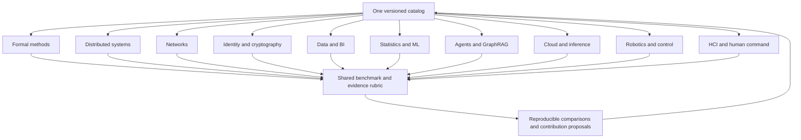

# Awesome Computer Science Systems — an inspectable reference atlas

**Ten focused computer-science reference lists with explicit evaluation axes, claim boundaries and a contributor path.** This repository connects network protocols, formal methods, distributed systems, identity, data, ML, agents, infrastructure, robotics and human command without pretending that one leaderboard or product can dominate all ten. The initial 40 entries are **editorial candidates pending human review**, not endorsements or benchmark winners.

The repository is one discovery surface. Each domain has its own page and scope. Maintainer-owned A2Z projects live in a [separate portfolio map](docs/portfolio-map.md), so the neutral reference lists do not become advertisements. This atlas is independent of `a2zsoc.com`, which is a separate business site.

## The ten lists

| List | Distinct question | Evaluation emphasis |
| --- | --- | --- |
| [Algorithms and Formal Methods](lists/algorithms-formal-methods.md) | Can a claim be proved or falsified under stated assumptions? | Invariants, counterexamples, solver limits |
| [Distributed Systems and Consensus](lists/distributed-systems.md) | What remains correct during failures? | Consistency, partitions, recovery |
| [Internet Routing and Network Protocols](lists/internet-network-protocols.md) | Is reachability both available and defensible? | Validation, convergence, affected prefixes |
| [Identity, Privileged Access and PQC](lists/identity-cryptography-pqc.md) | Who may act, and how does authority expire? | False grants, revocation, crypto migration |
| [Databases, Graphs and BI](lists/databases-graphs-bi.md) | Can a decision be reproduced from traceable data? | Snapshots, lineage, freshness, query cost |
| [Statistics, ML and Causality](lists/statistics-ml-causality.md) | Does a model improve an accepted decision? | Calibration, causal assumptions, generalization |
| [Agent Protocols, Memory and GraphRAG](lists/agents-memory-graphrag.md) | Can agents exchange tasks and use evidence correctly? | Conformance, grounding, cancellation |
| [Cloud, HPC and AI Inference](lists/cloud-hpc-inference.md) | What does accepted work cost at active load? | Throughput, p99, energy, recovery |
| [Robotics, Control and Digital Twins](lists/robotics-control-twins.md) | Does a policy remain safe beyond a simulator? | Interventions, safety events, transfer |
| [HCI and Human Command](lists/hci-human-command.md) | Can people understand and override complex automation? | Critical misses, workload, accessibility |

## System-of-systems relationship

The domains are independent editorial surfaces, not ten aliases for the same project. Cross-domain work belongs in a reproducible case study that names its source projects and evaluates the boundaries between them. The [methodology](docs/methodology.md) defines those gates. No list entry implies protocol conformance, certification, security approval or production readiness.

The first [cross-domain composition case](docs/composition-case.md) traces a synthetic data-center incident through **all ten** specialties, from a formal safety invariant to human override, with a separate benchmark at each boundary.

## How a reference becomes recommended

1. A contributor proposes a primary standard, benchmark or distinct implementation with an exact URL and a reason it belongs in one domain.
2. A domain reviewer checks scope, maintenance, license, reproducibility and the claimed capability. For benchmarks, they inspect workload, denominator, uncertainty and raw artifacts.
3. The entry becomes recommended only after human editorial approval. Machine checks prevent malformed catalog changes; they do not decide quality.
4. Retest references when versions or claims change. Record corrections and remove broken or misleading entries.

Start with [CONTRIBUTING.md](CONTRIBUTING.md). Source data is in [catalog/domains.json](catalog/domains.json); the ten pages are generated by `python3 scripts/build_lists.py`. Run `python3 scripts/build_lists.py --check` and `python3 -m unittest discover -s tests -v` before a PR.

## Growth and evaluation

This project measures **qualified use**, not just stars: unique external contributors, accepted PRs with reproducible evidence, visitors who follow a reference and run its example, and independent benchmark reproductions. Domain growth is evaluated separately to avoid one popular AI category masking an inactive network or HCI list. A public monthly change log can show added, corrected and retired references, but traffic or viral growth is never guaranteed.

The central [Awesome manifesto](https://github.com/sindresorhus/awesome/blob/main/awesome.md) calls for selectivity and personal recommendation. Its [submission rules](https://github.com/sindresorhus/awesome/blob/main/pull_request_template.md) currently require maturity and say lists submitted there must not be AI-generated. This atlas therefore makes **no claim of inclusion in that index** and will not submit these candidate pages as human-curated work without actual human review.

Catalog text is dedicated to the public domain under [CC0-1.0](LICENSE). Code under `scripts/` and `tests/` is available under [Apache-2.0](CODE-LICENSE).
