# Cross-domain case study: a reviewable data-center incident

This is an **unclassified synthetic evaluation design**, not a connected data center, router, robot or classified command environment. It illustrates why ten separate lists can be more useful together than one oversized list. The scenario is an authorized operator reviewing a simulated service degradation; every stage has a distinct owner, evidence contract and failure metric.

```mermaid
flowchart LR
  O[Human incident objective] --> F[Formal invariant and safe-action set]
  F --> D[Distributed task state and recovery]
  D --> N[Read-only network observations]
  N --> I[Identity and action authority]
  I --> B[Versioned data snapshot]
  B --> M[Calibrated anomaly and causal hypotheses]
  M --> A[Agent task with source-linked context]
  A --> H[Compute and inference placement]
  H --> R[Simulated inspection or digital twin]
  R --> U[Human review, override and feedback]
  U --> D
```

| List owner | Minimum input/output contract | Independent evaluation |
| --- | --- | --- |
| [Formal methods](../lists/algorithms-formal-methods.md) | Objective → versioned invariants and forbidden transitions | Counterexample coverage; proof assumptions |
| [Distributed systems](../lists/distributed-systems.md) | Task ID/state → durable transition receipt | Duplicate work, partition recovery, state divergence |
| [Networks](../lists/internet-network-protocols.md) | Read-only route event → timestamped reachability observation | Origin-validation errors, incident delay, missing routes |
| [Identity and cryptography](../lists/identity-cryptography-pqc.md) | Actor/workload credential → scoped, expiring decision | False grants, revocation lag, key lifecycle |
| [Data and BI](../lists/databases-graphs-bi.md) | Source records → immutable snapshot reference and lineage | Snapshot replay, freshness, query cost |
| [Statistics and ML](../lists/statistics-ml-causality.md) | Labeled history → calibrated hypothesis with uncertainty | Calibration, drift, false alert rate, causal assumptions |
| [Agent protocols and memory](../lists/agents-memory-graphrag.md) | Evidence IDs and grant → bounded task with citations | Task acceptance, source recall, unsupported claims |
| [Cloud and inference](../lists/cloud-hpc-inference.md) | Admitted task → measured execution placement | Active throughput, p99, idle cost, recovery |
| [Robotics and control](../lists/robotics-control-twins.md) | Simulator command proposal → safety-filtered observation | Envelope violations, interventions, transfer gap |
| [HCI and command](../lists/hci-human-command.md) | Decision packet → human accept/override/abstain | Critical misses, review latency, workload and accessibility |

The system-level score is a **vector**: independently accepted decisions, critical misses, unauthorized actions, duplicate side effects, p99 time to review, recovery time, affected tenants, full cost and human workload. Hard failures block any favorable average. A benchmark submission must include frozen fixture, independent labels, version pins and an exact reproduction command. A live-customer case additionally needs consent and permission to publish results.

The A2Z [portfolio map](portfolio-map.md) identifies candidate implementation boundaries. Those repositories are not assumed integrated merely because their names appear in the same diagram. A future PR can replace a synthetic boundary with a native adapter after conformance, fault and authorization tests.
