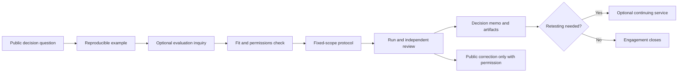

# Evaluation Lab: commercial hypothesis

The public atlas helps readers discover references and understand evaluation criteria. A possible paid **Evaluation Lab** would apply those published criteria to one organization's permitted workload. It is not a launched product, revenue claim, certification program or shortcut to inclusion in the atlas.

## First offer

Start in **one domain** with a fixed-scope comparison of two or three candidate systems. The buyer supplies the workload, constraints, permission to run tests and a decision owner. Deliver a written test protocol, raw and summarized results, reproducibility bundle, limitations, and a decision memo. Contract terms must specify access, data handling, third-party costs, disclosure and the right to report unfavorable findings. No private customer material enters the public atlas without explicit permission.

The proposed initial domain is distributed control-plane stores, using the [public decision example](decision-example.md) as a template. Expand to other domains only after the protocol, delivery time and buyer value repeat.

## Public and paid boundary

| Public atlas | Customer-funded evaluation |
| --- | --- |
| Domain scope, inclusion rubric and corrections | Customer-specific workload and constraints |
| Reference links and any permissioned public benchmark fixtures | Private adapters, data and operational context |
| Reproducibility requirements and claim labels | Scheduled test execution and decision workshop |
| Disclosed ownership and conflicts | Retest history and team-specific change alerts, if recurring demand emerges |

Payment never affects reference inclusion, ordering, status or a public correction. An A2Z-owned candidate is disclosed and evaluated under the same criteria. A customer can buy an evaluation without endorsing a public listing, and a contributor can submit a reference without becoming a customer. Any sponsorship must be plainly labeled outside rankings.

## Conversion and delivery loop

Keep the sales form short: decision to be made, workload class, candidate systems, decision date and contact details. Do not require proprietary inputs until there is a scoped agreement. Sell the evaluation outcome, not a generic directory subscription.

## Economics to validate

For each engagement record `price`, `paid acquisition cost`, `reviewer hours`, `engineering hours`, `compute and data cost`, `support hours` and `payment fees`. Define **contribution margin** as price minus those variable costs; report founder hours at a realistic labor rate rather than treating them as free. Track the share of work reused from the public protocol and the share that becomes customer-specific engineering.

Do not set a recurring price until at least three paid evaluations in the same domain show repeat demand. If each requires a different methodology, retain it as a scoped service. A recurring offer should cover a defined retest cadence and change-alert service, with a measured cost per customer. Expansion requires positive contribution margin, reproducible delivery by someone other than the founder, and no deterioration in public review quality.

Traffic is an input, not the success metric. Track qualified inquiries per domain, inquiry-to-paid conversion, median delivery time, reproducibility rate, customer use of findings in a decision, retest requests, and maintainer hours per accepted public reference. The public atlas can report contribution and evidence metrics without implying that stars or page views prove commercial demand.

## Maintenance model

Use structured catalog records and generated Markdown as the source of truth. Automate schema, duplicate and broken-link checks; leave inclusion and technical claims to named human reviewers. Review changes weekly, recheck high-traffic references quarterly, and record corrections or retirements. Add domain maintainers only with a written rubric and conflict disclosure. A searchable site is useful once GitHub navigation measurably fails; it should consume the same catalog rather than create another editorial database.
